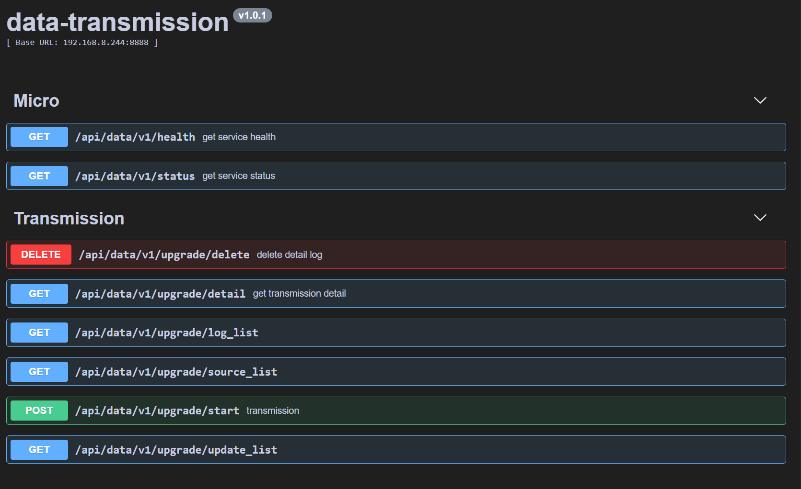

# Data Transmission

## Introduction

This project provides data transmission services for scenarios such as data storage, historical resource backup, database upgrade and migration, and container operating system upgrade and migration.


## Features

- Data Transmission
Start the data-transmission service on a local or cloud server. By synchronizing data resources, it synchronizes the data resources from server A to the specified upgraded server B.

- Data Storage
Fetch data resources from the URL defined by the source and store them at the specified target address.

- Data Backup
Download tarball files from a remote server, extract them to the specified address, and delete them after completion. Perform incremental backups of the original data resources.

- Database Upgrade
Support remote operations for database upgrade, migration, and backup.

- Container Operating System Upgrade
Support remote operations for containers, update configurations, module upgrades, and modify mappings.


## Usage

```
- golang version >= v1.22
```

```bash
go list (go mod tidy)
./build.sh data-transmission data-transmission
```

### Configure

```bash
vim data-transmission.toml
```

### StartUp

```bash
.data-transmission run
```

## API 



## UI


## Example

### start wget server

```bash
cd /wget_server
go run main.go -fileDir=./ -port=4567
```

### web server

runtime

```bash
cd ui
npm run dev
```

or build 

```bash 
cd ui
npm run build
```

## startup

```bash
./build data-transmission data-transmission
./data-transmission run
```
